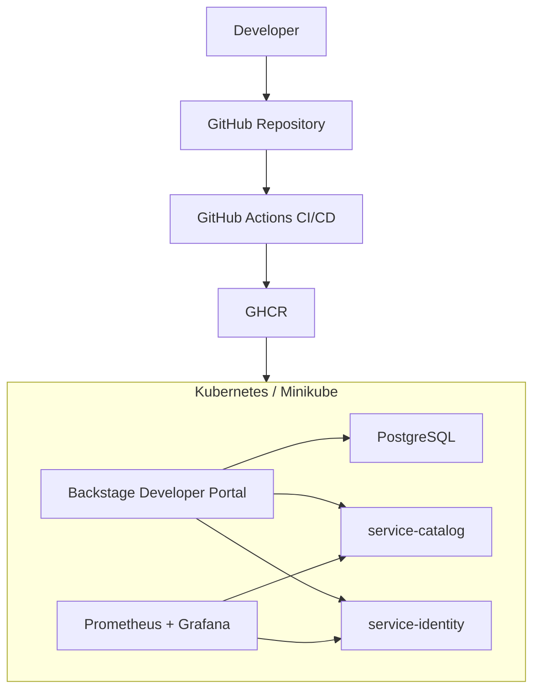

# Architecture

```mermaid
flowchart TD
  Dev["Developer"] --> Repo["GitHub Repository"]
  Repo --> CI["GitHub Actions CI/CD"]
  CI --> Registry["GHCR"]
  Registry --> K8s["Kubernetes / Minikube"]

  subgraph K8s["Kubernetes / Minikube"]
    Portal["Backstage Developer Portal"]
    Postgres["PostgreSQL"]
    Monitor["Prometheus + Grafana"]
    SvcA["service-catalog"]
    SvcB["service-identity"]
  end

  Portal --> Postgres
  Portal --> SvcA
  Portal --> SvcB
  Monitor --> SvcA
  Monitor --> SvcB
```
